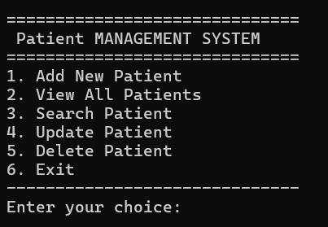
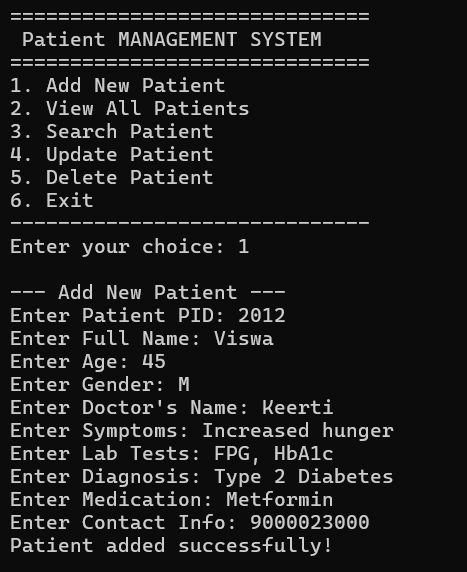
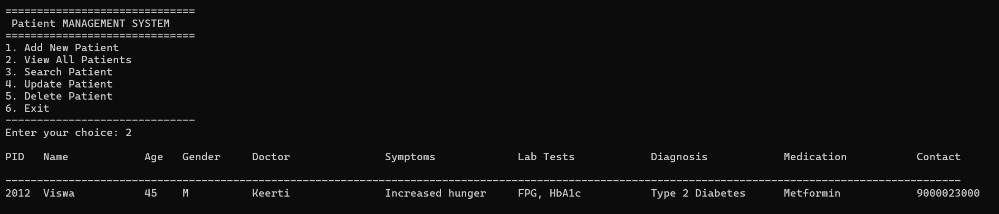
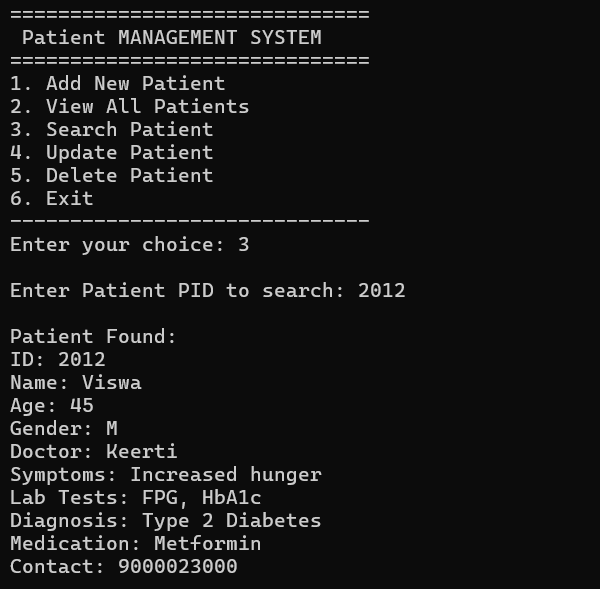
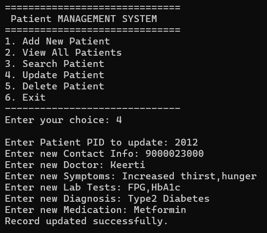
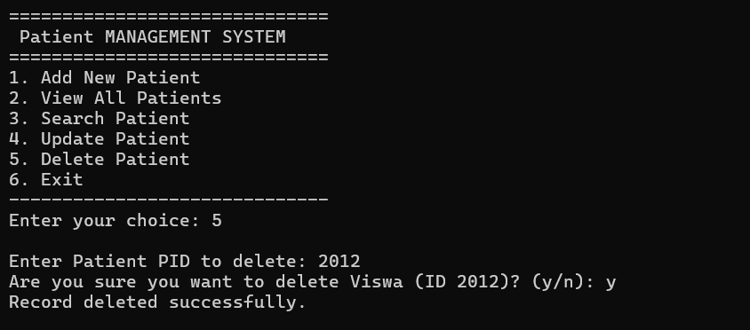
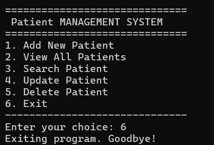

# <h6 align="center">Patient Management System</h6>

---

# *Abstract*

The **Patient Management System** is a simple, terminal-based application developed in **C** for managing patient records efficiently. The system provides fundamental functionalities including adding new patient details, searching for patients by ID or name, updating existing records, and deleting entries when necessary. All patient information is stored persistently in a binary `.dat` file, ensuring that data remains available across multiple sessions. Designed for ease of use, the program offers a menu-driven interface suitable for beginners and small-scale healthcare setups. The project demonstrates basic concepts of **file handling, data structures, and control flow** in C, providing a practical solution for managing patient data in a lightweight and accessible format.

---

## *Features of the Program*

* Add new patient records with details (name, age, gender, contact, medical info, etc.)
* View all stored patient records in a clean, organized list
* Search for patients by ID or name
* Update existing patient information
* Delete patient records from the database
* Persistent data storage using a `.dat` file
* Fully terminal-based (CLI) interface
* Beginner-friendly, easy-to-understand C program structure
* Automatically creates the data file if it doesn’t exist
* Basic error handling for invalid input and missing files

---

## **Technical Requirements**

#### **1. System Requirements**

* Operating System: Windows / Linux / macOS
* Terminal/command-line environment
* Minimum RAM: 4 MB
* Minimal disk space for the `.dat` file

#### **2. Software Requirements**

* C Compiler: GCC / MinGW / Clang / MSVC
* Any text editor or IDE (VS Code, Code::Blocks, Dev-C++, Vim, etc.)
* Optional: Make tool if using a Makefile

#### **3. Programming Requirements**

* Language: C
* Supported C Standards: C89 / C99 / C11
* Standard libraries required:

  * `<stdio.h>`
  * `<stdlib.h>`
  * `<string.h>`

#### **4. File Handling Requirements**

* Read/write access to the working directory
* Patient records stored in a binary `.dat` file
* Program creates the data file automatically if missing

#### **5. Compilation Requirements**

* Code should compile without errors
* Recommended flag: `-Wall` to show warnings

---

## **Functional Requirements**

#### **1. User Interface**

* Operates entirely through the terminal
* Clearly displays all menu options
* Accepts and validates user inputs

#### **2. Patient Record Operations**

* **Add Patient:** Enter and save new patient information
* **Search Patient:** Find records by patient ID or name
* **View Patients:** Display all stored records
* **Update Patient:** Modify existing patient details
* **Delete Patient:** Remove a record from the database

#### **3. Data Management**

* Stores all information in a persistent `.dat` file
* Ensures data remains available across multiple sessions
* Handles missing or new data files smoothly

#### **4. Program Flow**

* Uses a menu-driven loop until user selects Exit
* Provides confirmation and error messages
* Smooth navigation between different options

---

## **How to Run the Program**

#### **1. Compile the Program**

Open your terminal inside the project directory and run:

```bash
gcc patient_management.c -o patient_management
```

#### **2. Run the Executable**

###### On Linux/macOS:

```bash
./patient_management
```

###### On Windows:

```bash
patient_management.exe
```

#### **3. Data File**

* The program automatically creates `patients.dat` if it doesn't already exist
* All patient records are saved and retrieved from this file

---

# **Screenshots**

#### **1. Main Menu**

<p align="center">
  
</p>

#### **2. Add New Patient**

<p align="center">
  
</p>

#### **3. View All Patients**

<p align="center">
  
</p>

#### **4. Search Patient**

<p align="center">
  
</p>

#### **5. Update Patient**

<p align="center">
  
</p>

### **6. Delete Patient**

<p align="center">
  
</p>

### **6. Exit**

<p align="center">
  
</p>


---
